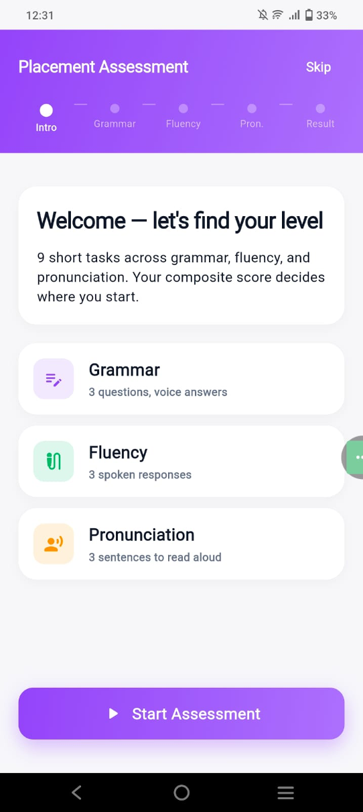
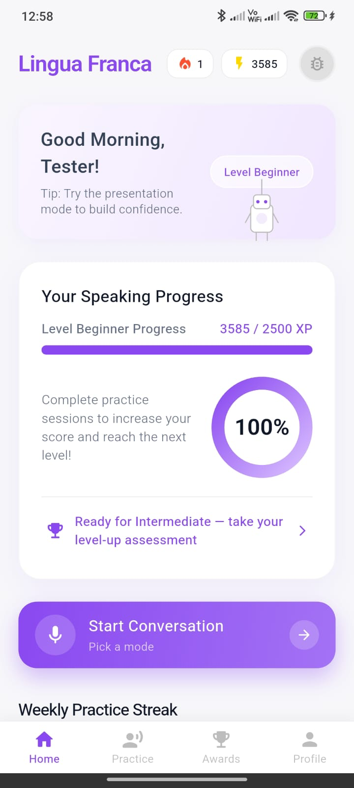
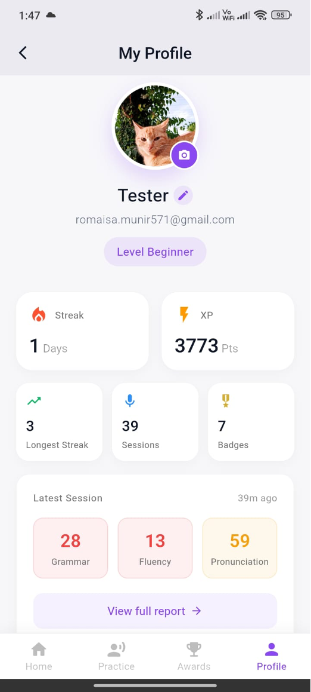
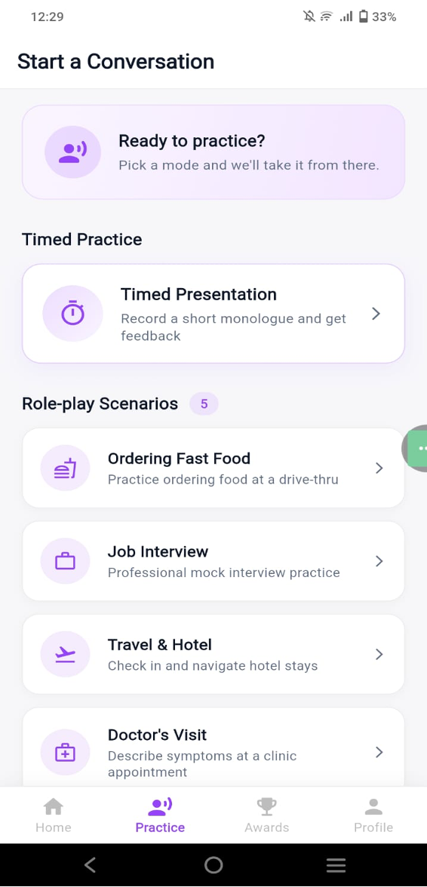
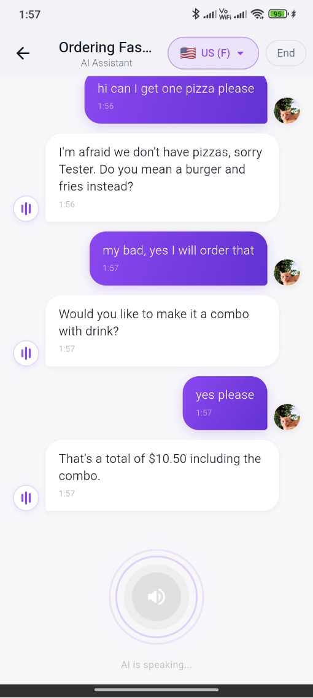
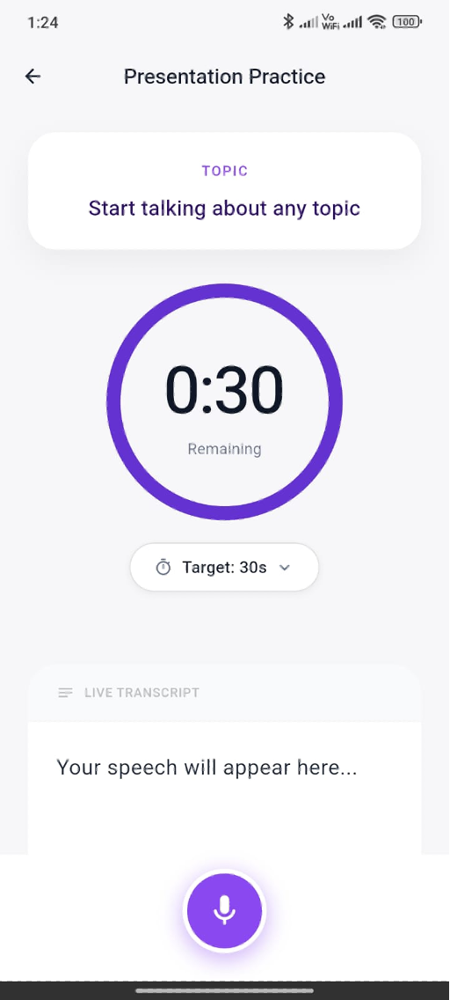
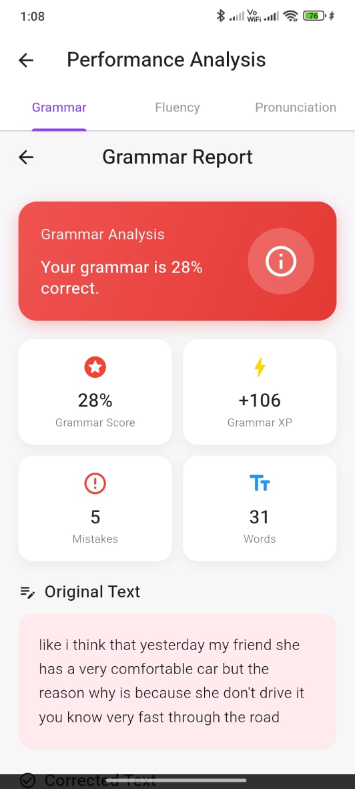
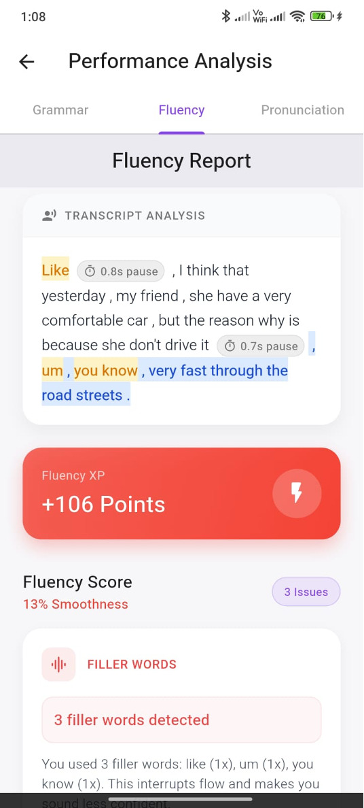
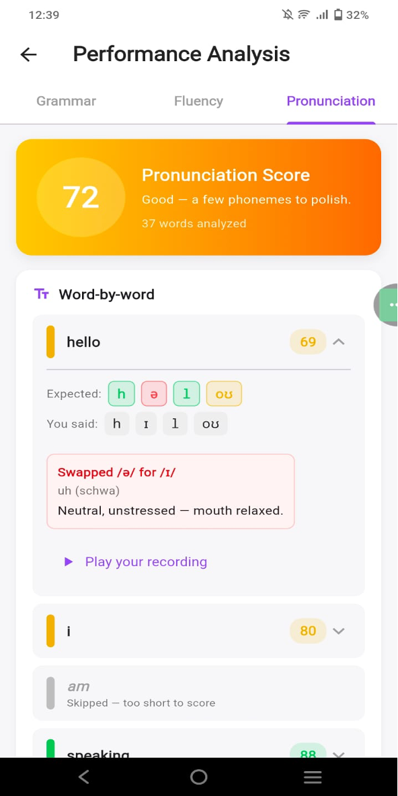
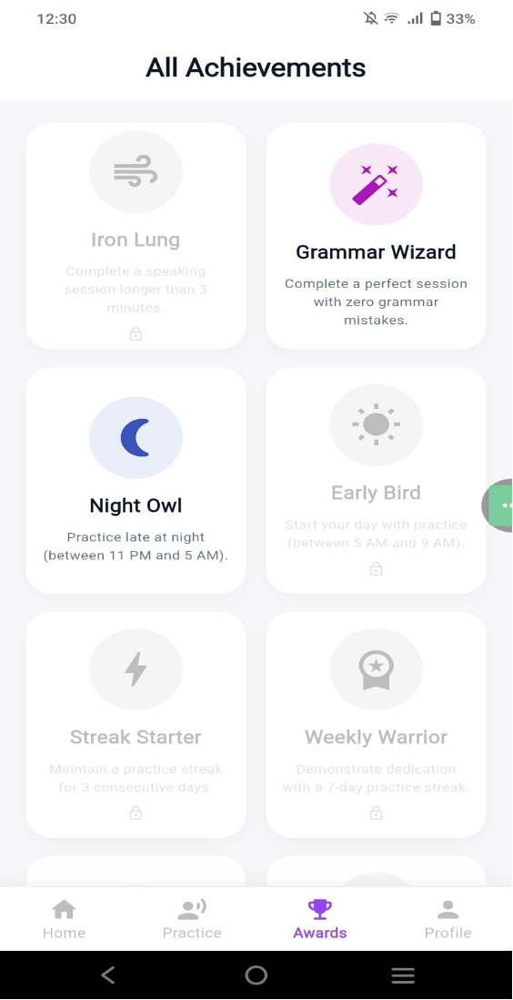

# Lingua Franca

An AI-powered mobile app for improving spoken English through real-time conversational practice, multi-dimensional speech analysis, and gamified progress tracking.

Built with **Flutter** (frontend) and four independent **Python FastAPI** backends.

---

## Screenshots

<table>
  <tr>
    <td align="center"><b>Placement Assessment</b><br/></td>
    <td align="center"><b>Home Dashboard</b><br/></td>
    <td align="center"><b>Profile</b><br/></td>
  </tr>
  <tr>
    <td align="center"><b>Practice Hub</b><br/></td>
    <td align="center"><b>Scenario Chat</b><br/></td>
    <td align="center"><b>Timed Presentation</b><br/></td>
  </tr>
  <tr>
    <td align="center"><b>Grammar Report</b><br/></td>
    <td align="center"><b>Fluency Report</b><br/></td>
    <td align="center"><b>Pronunciation Report</b><br/></td>
  </tr>
  <tr>
    <td></td>
    <td align="center"><b>Achievements</b><br/></td>
    <td></td>
  </tr>
</table>

---

## Features

### Scenario Chat Practice
- Voice-first conversational practice powered by **Ollama** (Llama 3.2 3B)
- Choose from curated real-world scenarios (job interview, restaurant, travel, etc.)
- Deepgram streams live transcription while you speak; the AI replies in real-time
- TTS responses delivered via the **Accent Engine** (Microsoft Edge neural voices) through `just_audio`
- Mic is automatically muted during TTS playback to prevent audio-session conflicts
- At session end, the full user transcript is run through grammar + fluency + pronunciation pipelines and feeds into the unified report

### Timed Presentation Practice
- Record yourself speaking on any topic with a configurable timer (15 s – 5 min)
- Live transcript powered by **Deepgram** streaming STT
- After recording, results from all three analysis backends are combined into a unified report
- XP and streak are updated automatically on completion

### Fluency Analysis
- Audio sent to the **Fluency Engine** (Cloud Run)
- Transcribed with **OpenAI Whisper** (`base`) with word-level timestamps
- Analyzed with **spaCy** (`en_core_web_md`): detects HARD fillers (um/uh/hmm) and context-aware SOFT fillers (so/like/basically/actually) using dependency-parse gating
- Evaluates speech speed, pacing consistency, and long pauses
- Filler words highlighted in an annotated transcript with severity markers (`[P-major]`, `[S]`, `[FAST]`, `[F]`, `[P-minor]`)

### Grammar Analysis
- Text checked via the **Grammar Engine** (Cloud Run)
- Three-stage pipeline: LanguageTool + spaCy + custom rules → T5 grammar correction (`vennify/t5-base-grammar-correction`) → diff comparison
- Returns per-mistake cards with severity, suggestions, and category breakdown; produces a `grammar_score` consumed by gamification

### Pronunciation Assessment
- Audio analyzed by the **Pronunciation Engine** (local/Docker)
- Wav2Vec2 phoneme recognition (`facebook/wav2vec2-lv-60-espeak-cv-ft`) + eSpeak-ng phonemizer
- Needleman-Wunsch phoneme alignment with phonologically-weighted costs
- Confidence-based GOP scoring: per-phoneme 0–100 scores aggregate to per-word and overall pronunciation scores
- Results displayed in a dedicated pronunciation report with phoneme-level breakdown

### Accent / TTS Engine
- Thin FastAPI wrapper over **Microsoft Edge neural voices** via `edge-tts`
- No API key, no local model — fast startup, zero cost
- Supports 6 voice profiles: American, British, and Pakistani (female/male each)
- Flutter client (`MyAudioSource`) feeds MP3 responses into `just_audio`

### Initial Placement & Level-Up Assessment
- Wizard-style assessment: intro → 3 grammar Qs → 3 fluency Qs → 3 pronunciation Qs → grading
- Determines starting CEFR level or validates a level-up attempt
- Results stored in Firestore and shown in `AssessmentResultScreen`

### Unified Report
- Single tabbed screen combining grammar, fluency, and pronunciation sub-reports
- Supports both fresh sessions and historical re-opens from the Profile screen (read-only mode skips duplicate Firestore writes)

### Gamification
- XP system with four CEFR levels: B1 → B2 (2500 XP) → C1 (7500 XP) → C2 (15 000 XP)
- Streak tracking by calendar day (Mon 11 PM → Tue 9 AM = 2-day streak)
- Achievement badges unlocked by milestones; full badge gallery in `BadgesScreen`
- Achievement pop-ups shown in-session on unlock

### Dashboard & Navigation
- Home screen: progress stats, streak, recent sessions, quick-start cards
- Practice Hub: scenario picker + timed presentation entry point
- Bottom navigation: Home · Practice · Profile
- `RootScaffold` manages shared navigation state

### Authentication & Storage
- Firebase Auth: email/password sign-up, login, forgot password, session persistence
- All analysis results (fluency + grammar + pronunciation) stored in Firestore under `users/{uid}/analyses`
- Gamification state (`totalXp`, `currentLevel`, `currentStreak`, `badges[]`, …) stored under `users/{uid}`

---

## Tech Stack

| Layer | Technology |
|-------|------------|
| **Frontend** | Flutter / Dart (SDK ≥ 3.7.2) |
| **AI Chat** | Ollama — Llama 3.2 3B |
| **Live STT** | Deepgram (streaming WebSocket) |
| **Fluency Backend** | Python FastAPI · OpenAI Whisper · spaCy — Cloud Run |
| **Grammar Backend** | Python FastAPI · LanguageTool · T5 — Cloud Run |
| **Pronunciation Backend** | Python FastAPI · Wav2Vec2 · eSpeak-ng — local / Docker |
| **Accent / TTS Backend** | Python FastAPI · edge-tts (Microsoft Edge voices) — local |
| **Auth & Storage** | Firebase Auth · Cloud Firestore |
| **Deployment** | Google Cloud Run (fluency + grammar) · Docker (pronunciation) |

---

## Project Structure

```
lib/
├── main.dart                               # Entry point; AuthWrapper gates on Firebase auth state
├── screens/
│   ├── root_scaffold.dart                  # Shared bottom-nav shell
│   ├── login_screen.dart
│   ├── signup_screen.dart
│   ├── forgot_password_screen.dart
│   ├── home_screen.dart                    # Dashboard — stats, streak, recent sessions
│   ├── profile_screen.dart                 # User profile & history
│   ├── practice_hub_screen.dart            # Scenario picker + timed presentation
│   ├── scenario_chat_screen.dart           # AI scenario chat (Deepgram → Ollama → TTS)
│   ├── timed_presentation_screen.dart      # Timed speaking practice
│   ├── unified_report_screen.dart          # Tabbed grammar + fluency + pronunciation report
│   ├── grammar_report_screen.dart          # Grammar sub-report
│   ├── fluency_screen.dart                 # Fluency sub-report
│   ├── pronunciation_report_screen.dart    # Pronunciation sub-report
│   ├── assessment_screen.dart              # Initial placement / level-up test wizard
│   ├── assessment_result_screen.dart       # Assessment outcome
│   ├── badges_screen.dart                  # Full achievement gallery
│   └── developers_screen.dart              # Dev-only entry point for test screens
├── services/
│   ├── auth_service.dart                   # Firebase Auth
│   ├── analysis_storage_service.dart       # Firestore writes (analyses + history)
│   ├── gamification_service.dart           # XP · streak · badges
│   ├── ollama_api_service.dart             # Llama 3.2 chat completions
│   ├── fluency_api_service.dart            # Fluency Engine client
│   ├── grammar_api_service.dart            # Grammar Engine client
│   ├── pronunciation_api_service.dart      # Pronunciation Engine client
│   ├── tts_api_service.dart                # Accent/TTS Engine client
│   ├── assessment_service.dart             # Assessment grading logic
│   ├── assessment_question_service.dart    # Assessment question bank
│   ├── audio_recorder_service.dart         # Recording + WAV file I/O
│   ├── my_audio_source.dart               # just_audio custom source for TTS MP3
│   └── stt_service.dart                   # (unused in production — sherpa-onnx stub)
│
fluency_engine/                             # Cloud Run — Whisper + spaCy
├── api.py
├── requirements.txt
├── Dockerfile
└── README.md

grammar_checker/                            # Cloud Run — LanguageTool + T5
├── python_api.py
├── requirements.txt
└── Dockerfile

pronunciation_engine/                       # Local / Docker — Wav2Vec2 + eSpeak-ng
├── api.py
├── phoneme_recognizer.py
├── phoneme_aligner.py
├── gop_scorer.py
├── requirements.txt
├── Dockerfile
├── docker-compose.yml
└── README.md

Accent_engine/                              # Local — edge-tts (Microsoft Edge voices)
├── tts_service.py
├── requirements.txt
└── README.md
```

---

## Getting Started

### Prerequisites
- Flutter SDK ≥ 3.7.2
- A Firebase project with Auth & Firestore enabled
- Python 3.10+ and `ffmpeg` (fluency + grammar backends)
- Python 3.11 specifically for the pronunciation engine (torch + transformers pinning)
- `espeak-ng` installed for pronunciation engine phonemization
- Ollama installed with `llama3.2:3b` pulled

### 1. Clone & Install Flutter Dependencies
```bash
git clone https://github.com/wardakhan0101/FYP-Project.git
cd FYP-Project
flutter pub get
```

### 2. Firebase Setup
Follow the detailed guide in [FIREBASE_SETUP.md](FIREBASE_SETUP.md), or quick-start:
```bash
dart pub global activate flutterfire_cli
flutterfire configure
```

### 3. Environment Variables
Create a `.env` file in the repo root (required — the app won't start without it):
```
STT=your_deepgram_api_key
FLUENCY_API_URL=https://your-fluency-cloud-run-url.run.app
PRONUNCIATION_API_URL=http://127.0.0.1:8001
OLLAMA_URL=http://192.168.x.x:11434/api/chat
```

> **Note:** `GRAMMAR_API_URL` is hard-coded in `lib/services/grammar_api_service.dart` — update it there if you redeploy.
>
> On macOS with a physical Android device, run `scripts/update_env_ip.sh` to auto-rewrite `OLLAMA_URL` with your Mac's current LAN IP and set `OLLAMA_HOST=0.0.0.0`. See [OLLAMA_ANDROID_SETUP.md](OLLAMA_ANDROID_SETUP.md) for the Wi-Fi vs. `adb reverse` trade-off. After editing `.env` you must fully stop and restart Flutter — hot reload won't pick it up.

### 4. Start Ollama
```bash
ollama run llama3.2:3b
```

### 5. Start the Accent / TTS Engine (local)
```bash
cd Accent_engine
python3 -m venv venv && source venv/bin/activate   # Windows: Activate.ps1
pip install -r requirements.txt
uvicorn tts_service:app --host 0.0.0.0 --port 8000
```
For a physical Android device: `adb reverse tcp:8000 tcp:8000`

### 6. Start the Pronunciation Engine (local)
**Option A — Docker (recommended):**
```bash
cd pronunciation_engine
docker compose up --build
# First build downloads the ~1.2 GB Wav2Vec2 model into a named volume
```
Served at `http://localhost:8001`.

**Option B — Python 3.11 locally:**
```bash
# macOS
brew install espeak-ng ffmpeg
cd pronunciation_engine
python3.11 -m venv venv && source venv/bin/activate
pip install -r requirements.txt
uvicorn api:app --reload --port 8001
```

### 7. Run the Flutter App
```bash
flutter run
```

---

## Backend API Reference

### Fluency Engine (`/analyze` · `POST`)
Upload a WAV file → returns annotated transcript, filler word list, fluency issues, and per-metric scores.

| Endpoint | Method | Description |
|----------|--------|-------------|
| `/analyze` | POST | Audio file → fluency report |
| `/health` | GET | `{"status": "ok", "model": "whisper-base"}` |

### Grammar Engine (`/check` · `POST`)
Submit plain text → returns corrected text, per-mistake cards (severity / suggestions / category), and a `grammar_score`.

### Pronunciation Engine (`/analyze` · `POST`)
Upload a WAV file + Whisper transcript + word timestamps → returns per-word and overall pronunciation scores with phoneme-level detail.

---

## Deployment (Cloud Run — Fluency & Grammar)

```bash
# Fluency engine
cd fluency_engine
gcloud builds submit --config cloudbuild.yaml .

# Grammar engine
cd grammar_checker
gcloud builds submit --config cloudbuild.yaml .
```

See [fluency_engine/README.md](fluency_engine/README.md) for the full step-by-step Cloud Run deployment guide.

---

## Platform Support

- **Android** (primary — validated on Redmi Note 14)
- Web (build target available; audio/mic features may be limited)
